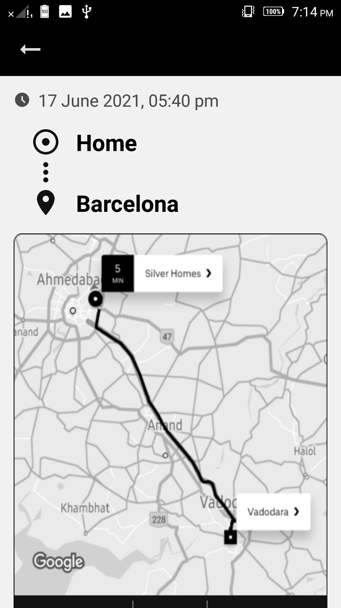

# Welcome to DriveSafe Repo! 👋 

---

   ## 
About DriveSafe

   
   - DriveSafe is a complete design kit for drivers to track their daily driving habits by tracking their trips, showing their daily trip reports, the exact route they took, the alerts triggered such as over-speeding, harsh-braking, car-idling, seat belt alerts, etc. and shows the necessary details on the dashboard.

   

    

   
   This repo contains UI design which is coded to learn UI. The original design can be found on [Figma.](https://www.figma.com/file/INva89ILCXxmfoUkJCyhva/Drivesafe?node-id=0%3A1&t=cOq1wsA0yzDwwxD8-1) 

---
   
   
   

   
 Some Screenshots from UI Development: 

 

 
Landing Page
  

  

Dashboard

  

Trip Detail Page

   

---
