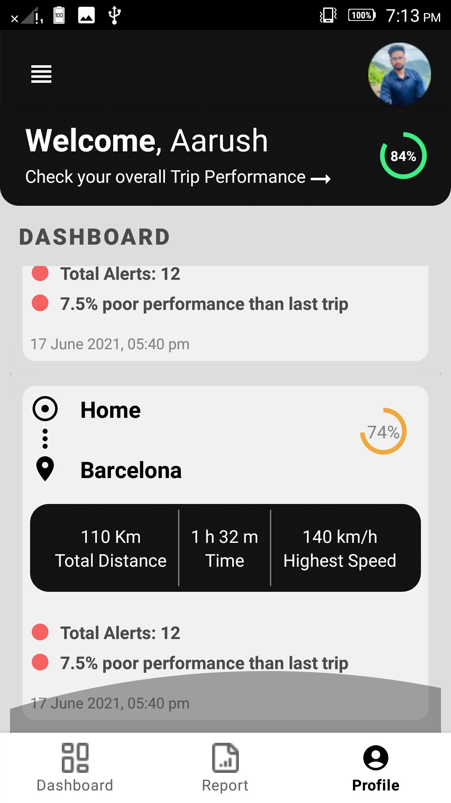

# Welcome to DriveSafe Repo! 👋 

---

   
About DriveSafe

   
   - DriveSafe is a complete design kit for drivers track their daily driving habits by tracking their trips, showing their daily trip reports, the exact route they took, the alerts triggered such as over-speeding, harsh-braking, car-idling, seat belt alerts, etc. and shows the necessary details on the dashboard.
   
   
   
   - This repo contains UI design which is coded to learn UI. The original design can be found on [Figma](https://www.figma.com/file/INva89ILCXxmfoUkJCyhva/Drivesafe?node-id=0%3A1&t=cOq1wsA0yzDwwxD8-1) 
   
   

---

---

   
 Screenshots: 

 

  

                    Landing Page                    Dashboard
                    

                                                    Trip Detail Page
   

---
